假设现在是 2015 年，你正在编写一个 ESM 到 CJS 的转译器。没有关于如何执行此操作的规范，你只有 ES 模块之间如何交互的规范、CommonJS 模块之间如何交互的知识，以及解决问题的天赋。考虑一个导出内容的 ES 模块：

```ts
export const A = {};
export const B = {};
export default "Hello, world!";
```

如何将其转换为 CommonJS 模块？回想一下，默认导出只是具有特殊语法的命名导出，似乎只有一种选择：

```ts
exports.A = {};
exports.B = {};
exports.default = "Hello, world!";
```

这是一个很好的类比，它允许你在导入端实现类似的效果：

```ts
import hello, { A, B } from "./module";
console.log(hello, A, B);

// transpiles to:

const module_1 = require("./module");
console.log(module_1.default, module_1.A, module_1.B);
```

到目前为止，CJS 世界中的所有内容都与 ESM 世界中的所有内容一一对应。将上述等价关系再延伸一步，我们可以看到：

```ts
import * as mod from "./module";
console.log(mod.default, mod.A, mod.B);

// transpiles to:

const mod = require("./module");
console.log(mod.default, mod.A, mod.B);
```

你可能会注意到，在这种方案中，无法编写一个 ESM 导出，使得输出中 `exports` 被赋值为函数、类或原始值：

```ts
// @Filename: exports-function.js
module.exports = function hello() {
  console.log("Hello, world!");
};
```

但现有的 CommonJS 模块经常采用这种形式。使用我们的转译器处理的 ESM 导入如何访问这个模块呢？我们刚刚确定命名空间导入（`import *`）会转译为普通的 `require` 调用，因此我们可以支持如下输入：

```ts
import * as hello from "./exports-function";
hello();

// transpiles to:

const hello = require("./exports-function");
hello();
```

我们的输出在运行时有效，但我们有一个合规性问题：根据 JavaScript 规范，命名空间导入始终解析为 [_模块命名空间对象_](https://tc39.es/ecma262/#sec-module-namespace-objects)，即一个其成员是模块导出的对象。在这种情况下，`require` 将返回函数 `hello`，但 `import *` 永远不能返回函数。我们假设的对应关系似乎无效。

值得在这里退一步，澄清一下 _目标_ 是什么。一旦模块在 ES2015 规范中落地，转译器就出现了，支持将 ESM 降级到 CJS，允许用户在运行时实现支持之前很久就采用新语法。甚至有一种感觉，编写 ESM 代码是一种"面向未来"新项目的良好方式。要做到这一点，需要有一条从执行转译器的 CJS 输出到在运行时支持后执行 ESM 输入的无缝迁移路径。目标是找到一种将 ESM 降级到 CJS 的方法，允许将所有这些转译输出替换为它们的真实 ESM 输入，而不会观察到行为变化。

通过遵循规范，转译器很容易找到一组转换，使其转译的 CommonJS 输出的语义与其 ESM 输入的指定语义相匹配（箭头表示导入）：



然而，CommonJS 模块（以 CommonJS 编写，而非转译为 CommonJS 的 ESM）在 Node.js 生态系统中已经根深蒂固，因此以 ESM 编写并转译为 CJS 的模块不可避免地会开始"导入"以 CommonJS 编写的模块。但是，这种互操作性的行为并未由 ES2015 指定，也不存在于任何真实运行时中。



即使转译器作者什么都不做，现有转译代码中发出的 `require` 调用与现有 CJS 模块中定义的 `exports` 之间的现有语义也会产生一种行为。为了允许用户从转译的 ESM 无缝过渡到真正的 ESM，该行为必须与运行时选择实现的行为相匹配。

猜测运行时支持的互操作行为不仅限于 ESM 导入"真正的 CJS"模块。ESM 是否能够识别从 CJS 转译而来的 ESM 与 CJS 的区别，以及 CJS 是否能够 `require` ES 模块，也是未指定的。甚至 ESM 导入是否会使用与 CJS `require` 调用相同的模块解析算法也是不可知的。所有这些变量都必须被正确预测，才能为转译器用户提供无缝迁移到原生 ESM 的路径。

## `allowSyntheticDefaultImports` 和 `esModuleInterop`

让我们回到规范合规性问题，即 `import *` 转译为 `require`：

```ts
// Invalid according to the spec:
import * as hello from "./exports-function";
hello();

// but the transpilation works:
const hello = require("./exports-function");
hello();
```

当 TypeScript 首次添加对编写和转译 ES 模块的支持时，编译器通过在任何命名空间导入 `exports` 不是命名空间对象的模块时发出错误来解决这个问题：

```ts
import * as hello from "./exports-function";
// TS2497              ^^^^^^^^^^^^^^^^^^^^
// External module '"./exports-function"' resolves to a non-module entity
// and cannot be imported using this construct.
```

唯一的解决方法是让用户回到使用代表 CommonJS `require` 的旧 TypeScript 导入语法：

```ts
import hello = require("./exports-function");
```

强制用户恢复使用非 ESM 语法本质上是在承认"我们不知道 CJS 模块 `"./exports-function"` 将来如何或是否能够通过 ESM 导入访问，但我们知道它 _不能_ 通过 `import *` 访问，即使它在我们使用的转译方案中在运行时有效。"这不符合允许此文件在不做更改的情况下迁移到真正 ESM 的目标，但允许 `import *` 链接到函数的替代方案也不符合。当 `allowSyntheticDefaultImports` 和 `esModuleInterop` 被禁用时，这仍然是 TypeScript 今天的行为。

> 不幸的是，这是一个稍微的简化——TypeScript 并没有通过这个错误完全避免合规性问题，因为它允许函数的命名空间导入工作，并保留其调用签名，只要函数声明与命名空间声明合并——即使命名空间为空。因此，虽然导出裸函数的模块被识别为"非模块实体"：
> ```ts
> declare function $(selector: string): any;
> export = $; // Cannot `import *` this 👍
> ```
> 一个应该无意义的更改允许无效导入在没有错误的情况下进行类型检查：
> ```ts
> declare namespace $ {}
> declare function $(selector: string): any;
> export = $; // Allowed to `import *` this and call it 😱
> ```

与此同时，其他转译器正在提出解决相同问题的方法。思考过程大致如下：

1. 要导入导出函数或原始值的 CJS 模块，我们显然需要使用默认导入。命名空间导入是非法的，命名导入在这里没有意义。
2. 最有可能的是，这意味着实现 ESM/CJS 互操作的运行时将选择使 CJS 模块的默认导入 _始终_ 直接链接到整个 `exports`，而不是仅在 `exports` 是函数或原始值时才这样做。
3. 因此，真正的 CJS 模块的默认导入应该像 `require` 调用一样工作。但我们需要一种方法来区分真正的 CJS 模块和我们转译的 CJS 模块，这样我们仍然可以将 `export default "hello"` 转译为 `exports.default = "hello"`，并让 _该_ 模块的默认导入链接到 `exports.default`。基本上，我们自己的转译模块之一的默认导入需要以一种方式工作（模拟 ESM 到 ESM 的导入），而任何其他现有 CJS 模块的默认导入需要以另一种方式工作（模拟我们认为 ESM 到 CJS 导入将如何工作）。
4. 当我们将 ES 模块转译为 CJS 时，让我们在输出中添加一个特殊的额外字段：
>    ```ts
>    exports.A = {};
>    exports.B = {};
>    exports.default = "Hello, world!";
>    // Extra special flag!
>    exports.__esModule = true;
>    ```
>    我们可以在转译默认导入时检查它：
>    ```ts
>    // import hello from "./module";
>    const _mod = require("./module");
>    const hello = _mod.__esModule ? _mod.default : _mod;
>    ```

`__esModule` 标志首先出现在 Traceur 中，然后很快出现在 Babel、SystemJS 和 Webpack 中。TypeScript 在 1.8 中添加了 `allowSyntheticDefaultImports`，允许类型检查器将默认导入直接链接到任何缺少 `export default` 声明的模块类型的 `exports`，而不是 `exports.default`。该标志没有修改导入或导出的生成方式，但允许默认导入反映其他转译器将如何处理它们。也就是说，它允许使用默认导入来解析"非模块实体"，而 `import *` 是一个错误：

```ts
// Error:
import * as hello from "./exports-function";

// Old workaround:
import hello = require("./exports-function");

// New way, with `allowSyntheticDefaultImports`:
import hello from "./exports-function";
```

这通常足以让 Babel 和 Webpack 用户编写在这些系统中已经工作的代码，而 TypeScript 不会抱怨，但这只是一个部分解决方案，留下了几个未解决的问题：

1. Babel 和其他工具根据目标模块上是否找到 `__esModule` 属性来改变其默认导入行为，但 `allowSyntheticDefaultImports` 仅在目标模块的类型中未找到默认导出时才启用 _回退_ 行为。如果目标模块有 `__esModule` 标志但 _没有_ 默认导出，这就会产生不一致。转译器和打包器仍然会将此类模块的默认导入链接到其 `exports.default`，这将是 `undefined`，并且理想情况下在 TypeScript 中应该是一个错误，因为真正的 ESM 导入在无法链接时会导致错误。但使用 `allowSyntheticDefaultImports`，TypeScript 会认为此类导入的默认导入链接到整个 `exports` 对象，允许将其属性作为命名导出访问。
2. `allowSyntheticDefaultImports` 没有改变命名空间导入的类型，产生了一个奇怪的矛盾，即两者都可以使用且具有相同的类型：
>    ```ts
>    // @Filename: exportEqualsObject.d.ts
>    declare const obj: object;
>    export = obj;
>
>    // @Filename: main.ts
>    import objDefault from "./exportEqualsObject";
>    import * as objNamespace from "./exportEqualsObject";
>
>    // This should be true at runtime, but TypeScript gives an error:
>    objNamespace.default === objDefault;
>    //           ^^^^^^^ Property 'default' does not exist on type 'typeof import("./exportEqualsObject")'.
>    ```
3. 最重要的是，`allowSyntheticDefaultImports` 没有改变 `tsc` 生成的 JavaScript。因此，虽然该标志启用了更准确的检查，只要代码被输入到 Babel 或 Webpack 等其他工具中，但对于使用 `tsc` 生成 `--module commonjs` 并在 Node.js 中运行的用户来说，它造成了真正的危险。如果他们遇到 `import *` 错误，启用 `allowSyntheticDefaultImports` 似乎可以修复它，但实际上它只是消除了构建时错误，而生成的代码会在 Node 中崩溃。

TypeScript 在 2.7 中引入了 `esModuleInterop` 标志，它改进了导入的类型检查，以解决 TypeScript 的分析与现有转译器和打包器中使用的互操作行为之间的剩余不一致，并且关键的是，采用了转译器多年前采用的相同的 `__esModule` 条件 CommonJS 生成。（`import *` 的另一个新的生成辅助函数确保结果始终是一个对象，调用签名被剥离，完全解决了上述"解析为非模块实体"错误未能回避的规范合规性问题。）最后，启用新标志后，TypeScript 的类型检查、TypeScript 的生成以及其余的转译和打包生态系统在 CJS/ESM 互操作方案上达成了一致，该方案符合规范，而且也许可以被 Node 采用。

## Node.js 中的互操作性

Node.js 在 v12 中取消了对 ES 模块支持的标记。像打包器和转译器多年前开始做的那样，Node.js 为 CommonJS 模块提供了一个 `exports` 对象的"合成默认导出"，允许从 ESM 使用默认导入访问整个模块内容：

```ts
// @Filename: export.cjs
module.exports = { hello: "world" };

// @Filename: import.mjs
import greeting from "./export.cjs";
greeting.hello; // "world"
```

这是无缝迁移的一个胜利！不幸的是，相似之处基本上到此为止。

### 没有 `__esModule` 检测（"双默认"问题）

Node.js 无法尊重 `__esModule` 标记来改变其默认导入行为。因此，一个具有"默认导出"的转译模块在被另一个转译模块"导入"时以一种方式运行，在被 Node.js 中的真正 ES 模块导入时以另一种方式运行：

```ts
// @Filename: node_modules/dependency/index.js
exports.__esModule = true;
exports.default = function doSomething() { /*...*/ }

// @Filename: transpile-vs-run-directly.{js/mjs}
import doSomething from "dependency";
// Works after transpilation, but not a function in Node.js ESM:
doSomething();
// Doesn't exist after transpilation, but works in Node.js ESM:
doSomething.default();
```

虽然转译的默认导入仅在目标模块缺少 `__esModule` 标志时才生成合成默认导出，但 Node.js _始终_ 合成一个默认导出，在转译模块上创建一个"双默认"。

### 不可靠的命名导出

除了将 CommonJS 模块的 `exports` 对象作为默认导入可用外，Node.js 还尝试查找 `exports` 的属性，使其作为命名导入可用。当有效时，此行为与打包器和转译器匹配；然而，Node.js 使用[语法分析](https://github.com/nodejs/cjs-module-lexer)在任何代码执行之前合成命名导出，而转译模块在运行时解析其命名导入。结果是，在转译模块中有效的 CJS 模块导入可能在 Node.js 中不起作用：

```ts
// @Filename: named-exports.cjs
exports.hello = "world";
exports["worl" + "d"] = "hello";

// @Filename: transpile-vs-run-directly.{js/mjs}
import { hello, world } from "./named-exports.cjs";
// `hello` works, but `world` is missing in Node.js 💥

import mod from "./named-exports.cjs";
mod.world;
// Accessing properties from the default always works ✅
```

### 在 Node.js v22 之前无法 `require` 真正的 ES 模块

真正的 CommonJS 模块可以 `require` 一个转译为 CJS 的 ESM 模块，因为它们在运行时都是 CommonJS。但在早于 v22.12.0 的 Node.js 版本中，如果 `require` 解析到 ES 模块，它会崩溃。这意味着已发布的库无法从转译模块迁移到真正的 ESM，而不会破坏其 CommonJS（真正的或转译的）消费者：

```ts
// @Filename: node_modules/dependency/index.js
export function doSomething() { /* ... */ }

// @Filename: dependent.js
import { doSomething } from "dependency";
// ✅ Works if dependent and dependency are both transpiled
// ✅ Works if dependent and dependency are both true ESM
// ✅ Works if dependent is true ESM and dependency is transpiled
// 💥 Crashes if dependent is transpiled and dependency is true ESM
```

### 不同的模块解析算法

Node.js 引入了一种新的模块解析算法来解析 ESM 导入，这与长期存在的解析 `require` 调用的算法有很大不同。虽然这与 CJS 和 ES 模块之间的互操作性没有直接关系，但这种差异是从转译模块无缝迁移到真正 ESM 的另一个障碍：

```ts
// @Filename: add.js
export function add(a, b) {
  return a + b;
}

// @Filename: math.js
export * from "./add";
//            ^^^^^^^
// Works when transpiled to CJS,
// but would have to be "./add.js"
// in Node.js ESM.
```

## 结论

显然，从转译模块无缝迁移到 ESM 是不可能的，至少在 Node.js 中是如此。这让我们何去何从？

### 设置正确的 `module` 编译器选项至关重要

由于互操作性规则因宿主而异，TypeScript 无法提供正确的检查行为，除非它了解它看到的每个文件代表的模块类型，以及要对它们应用哪组规则。这就是 `module` 编译器选项的目的。（特别是，打算在 Node.js 中运行的代码比将由打包器处理的代码受更严格的规则约束。除非将 `module` 设置为 `node16`、`node18` 或 `nodenext`，否则编译器的输出不会检查 Node.js 兼容性。）

### 具有 CommonJS 代码的应用程序应始终启用 `esModuleInterop`

在 TypeScript _应用程序_（与可能被其他人使用的库相对）中，当使用 `tsc` 生成 JavaScript 文件时，是否启用 `esModuleInterop` 没有重大后果。你为某些类型的模块编写导入的方式会改变，但 TypeScript 的检查和生成是同步的，因此无错误的代码在任一模式下都应该可以安全运行。在这种情况下禁用 `esModuleInterop` 的缺点是，它允许你编写明显违反 ECMAScript 规范的 JavaScript 代码，混淆对命名空间导入的直觉，并使将来迁移到运行 ES 模块变得更加困难。

在由第三方转译器或打包器处理的应用程序中，另一方面，启用 `esModuleInterop` 更为重要。所有主要的打包器和转译器都使用类似 `esModuleInterop` 的生成策略，因此 TypeScript 需要调整其检查以匹配。（编译器总是推理 `tsc` 将生成的 JavaScript 文件中会发生什么，因此即使使用其他工具代替 `tsc`，也应该将生成影响的编译器选项设置为尽可能接近该工具的输出。）

应避免在没有 `esModuleInterop` 的情况下使用 `allowSyntheticDefaultImports`。它改变了编译器的检查行为，而不改变 `tsc` 生成的代码，允许生成潜在不安全的 JavaScript。此外，它引入的检查更改是 `esModuleInterop` 引入的更改的不完整版本。即使不使用 `tsc` 进行生成，启用 `esModuleInterop` 也比 `allowSyntheticDefaultImports` 更好。

有些人反对在启用 `esModuleInterop` 时包含 `tsc` 的 JavaScript 输出中包含的 `__importDefault` 和 `__importStar` 辅助函数，要么是因为它略微增加了磁盘上的输出大小，要么是因为辅助器采用的互操作算法通过检查 `__esModule` 似乎误代表了 Node.js 的互操作行为，导致了前面讨论的危险。这两个反对意见都可以在不接受禁用 `esModuleInterop` 时表现出的有缺陷检查行为的情况下，至少部分地解决。首先，可以使用 `importHelpers` 编译器选项从 `tslib` 导入辅助函数，而不是将它们内联到每个需要它们的文件中。为了讨论第二个反对意见，让我们看最后一个例子：

```ts
// @Filename: node_modules/transpiled-dependency/index.js
exports.__esModule = true;
exports.default = function doSomething() { /* ... */ };
exports.something = "something";

// @Filename: node_modules/true-cjs-dependency/index.js
module.exports = function doSomethingElse() { /* ... */ };

// @Filename: src/sayHello.ts
export default function sayHello() { /* ... */ }
export const hello = "hello";

// @Filename: src/main.ts
import doSomething from "transpiled-dependency";
import doSomethingElse from "true-cjs-dependency";
import sayHello from "./sayHello.js";
```

假设我们正在将 `src` 编译为 CommonJS 以在 Node.js 中使用。如果没有 `allowSyntheticDefaultImports` 或 `esModuleInterop`，从 `"true-cjs-dependency"` 导入 `doSomethingElse` 是一个错误，而其他则不是。要在不更改任何编译器选项的情况下修复错误，你可以将导入更改为 `import doSomethingElse = require("true-cjs-dependency")`。然而，取决于模块的类型（未显示）是如何编写的，你也可以编写并调用一个命名空间导入，这将是语言级别的规范违规。使用 `esModuleInterop`，所示的导入都不是错误（并且都是可调用的），但无效的命名空间导入会被捕获。

如果我们决定要将 `src` 迁移到 Node.js 中的真正 ESM（例如，在我们的根 package.json 中添加 `"type": "module"`），会发生什么变化？第一个导入，从 `"transpiled-dependency"` 导入的 `doSomething`，将不再可调用——它表现出"双默认"问题，我们必须调用 `doSomething.default()` 而不是 `doSomething()`。（TypeScript 在 `--module node16` 或 `--module nodenext` 下理解并捕获这一点。）但值得注意的是，_第二个_ 导入 `doSomethingElse`，它在编译为 CommonJS 时需要 `esModuleInterop` 才能工作，在真正的 ESM 中工作正常。

如果这里有什么可抱怨的，那不是 `esModuleInterop` 对第二个导入做了什么。它所做的更改，既允许默认导入又阻止可调用的命名空间导入，完全符合 Node.js 的真实 ESM/CJS 互操作策略，并使迁移到真正的 ESM 更容易。问题（如果有的话）是 `esModuleInterop` 似乎未能为我们提供 _第一个_ 导入的无缝迁移路径。但这个问题不是由启用 `esModuleInterop` 引入的；第一个导入完全不受它影响。不幸的是，如果不破坏 `main.ts` 和 `sayHello.ts` 之间的语义契约，这个问题就无法解决，因为 `sayHello.ts` 的 CommonJS 输出在结构上与 `transpiled-dependency/index.js` 相同。如果 `esModuleInterop` 改变了 `doSomething` 的转译导入的工作方式，使其与在 Node.js ESM 中的工作方式相同，它也会以同样的方式改变 `sayHello` 导入的行为，使输入代码违反 ESM 语义（因此仍然阻止 `src` 目录在不进行更改的情况下迁移到 ESM）。

正如我们所见，从转译模块到真正 ESM 没有无缝迁移路径。但 `esModuleInterop` 是朝着正确方向迈出的一步。对于那些仍然希望最小化模块语法转换和导入辅助函数包含的人来说，启用 `verbatimModuleSyntax` 是比禁用 `esModuleInterop` 更好的选择。`verbatimModuleSyntax` 强制在生成 CommonJS 的文件中使用 `import mod = require("mod")` 和 `export = ns` 语法，避免了我们讨论过的所有导入歧义，代价是迁移到真正 ESM 的便利性。

### 库代码需要特殊考虑

作为 CommonJS 发布的库应避免使用默认导出，因为访问这些转译导出的方式因不同工具和运行时而异，其中一些方式对用户来说看起来会很混乱。由 `tsc` 转译为 CommonJS 的默认导出在 Node.js 中可以作为默认导入的 default 属性访问：

```js
import pkg from "pkg";
pkg.default();
```

在大多数打包器或转译的 ESM 中作为默认导入本身：

```js
import pkg from "pkg";
pkg();
```

在普通 CommonJS 中作为 `require` 调用的 default 属性：

```js
const pkg = require("pkg");
pkg.default();
```

如果用户必须访问默认导入的 `.default` 属性，他们会检测到配置错误的模块异味，如果他们试图编写在 Node.js 和打包器中都运行的代码，他们可能会陷入困境。一些第三方 TypeScript 转译器公开了更改默认导出生成方式的选项，以缓解这种差异，但它们不生成自己的声明（`.d.ts`）文件，因此这会在运行时行为和类型检查之间产生不匹配，进一步混淆和挫败用户。库不应使用默认导出，而应使用 `export =` 表示具有单个主导出的模块，或使用命名导出表示具有多个导出的模块：

```diff
- export default function doSomething() { /* ... */ }
+ export = function doSomething() { /* ... */ }
```

库（发布声明文件的库）还应该格外小心，确保它们编写的类型在各种编译器选项下都没有错误。例如，可以编写一个扩展另一个接口的接口，使其仅在禁用 `strictNullChecks` 时才能成功编译。如果库要发布这样的类型，它会强制所有用户也禁用 `strictNullChecks`。`esModuleInterop` 可以允许类型声明包含类似的"传染性"默认导入：

```ts
// @Filename: /node_modules/dependency/index.d.ts
import express from "express";
declare function doSomething(req: express.Request): any;
export = doSomething;
```

假设此默认导入 _仅_ 在启用 `esModuleInterop` 时才有效，并且在用户没有该选项引用此文件时会导致错误。用户 _应该_ 启用 `esModuleInterop`，但库使其配置如此传染通常被视为不良形式。如果库像这样发布声明文件，情况会好得多：

```ts
import express = require("express");
// ...
```

这样的例子导致了传统观点，即库 _不应_ 启用 `esModuleInterop`。这个建议是一个合理的起点，但我们已经看到了命名空间导入的类型如何变化的例子，当启用 `esModuleInterop` 时，可能会 _引入_ 错误。因此，无论库是否使用 `esModuleInterop` 编译，它们都有风险编写使其选择具有传染性的语法。

希望超越并确保最大兼容性的库作者最好针对编译器选项矩阵验证其声明文件。但使用 `verbatimModuleSyntax` 完全回避了 `esModuleInterop` 的问题，强制在生成 CommonJS 的文件中使用 CommonJS 风格的导入和导出语法。此外，由于 `esModuleInterop` 只影响 CommonJS，随着更多库随着时间的推移转向仅 ESM 发布，此问题的相关性将降低。

<!--

https://github.com/babel/babel/issues/493
https://github.com/babel/babel/issues/95
https://github.com/nodejs/node/pull/16675
https://github.com/nodejs/ecmascript-modules/pull/31
https://github.com/google/traceur-compiler/pull/785#issuecomment-35633727
https://github.com/microsoft/TypeScript/pull/2460
https://github.com/microsoft/TypeScript/pull/5577
https://github.com/microsoft/TypeScript/pull/19675
https://github.com/microsoft/TypeScript/issues/16093
https://github.com/nodejs/modules/issues/139
https://github.com/microsoft/TypeScript/issues/54212

-->
