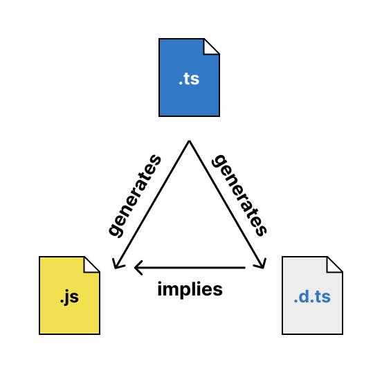

## JavaScript 中的脚本与模块

在 JavaScript 的早期，当这门语言只能在浏览器中运行时，并没有模块的概念，但仍然可以通过在 HTML 中使用多个 `script` 标签来将网页的 JavaScript 代码拆分到多个文件中：

```html
<html>
  <head>
    <script src="a.js"></script>
    <script src="b.js"></script>
  </head>
  <body></body>
</html>
```

这种方法有一些缺点，尤其是随着网页变得越来越庞大和复杂。特别是，所有加载到同一页面的脚本共享同一个作用域——恰当地称为"全局作用域"——这意味着脚本必须非常小心，不要覆盖彼此的变量和函数。

任何通过给文件提供自己的作用域，同时仍然提供一种方式让代码片段可供其他文件使用的系统，都可以称为"模块系统"。（说模块系统中的每个文件都称为"模块"可能听起来很明显，但这个术语通常用于与 _脚本_ 文件形成对比，脚本文件在模块系统之外运行，处于全局作用域中。）

> 存在 [许多模块系统](https://github.com/myshov/history-of-javascript/tree/master/4_evolution_of_js_modularity)，TypeScript [支持生成多种模块](https://www.typescriptlang.org/tsconfig/#module)，但本文档将聚焦于当今最重要的两个系统：ECMAScript 模块（ESM）和 CommonJS（CJS）。
>
> ECMAScript 模块（ESM）是内置于语言中的模块系统，在现代浏览器和 Node.js v12+ 中得到支持。它使用专门的 `import` 和 `export` 语法：
>
> ```js
> // a.js
> export default "Hello from a.js";
> ```
>
> ```js
> // b.js
> import a from "./a.js";
> console.log(a); // 'Hello from a.js'
> ```
>
> CommonJS（CJS）是最初随 Node.js 一起发布的模块系统，在 ESM 成为语言规范的一部分之前就已存在。它在 Node.js 中仍然与 ESM 并存。它使用名为 `exports` 和 `require` 的普通 JavaScript 对象和函数：
>
> ```js
> // a.js
> exports.message = "Hello from a.js";
> ```
>
> ```js
> // b.js
> const a = require("./a");
> console.log(a.message); // 'Hello from a.js'
> ```

因此，当 TypeScript 检测到文件是 CommonJS 或 ECMAScript 模块时，它首先假设该文件将拥有自己的作用域。除此之外，编译器的工作变得更加复杂。

## TypeScript 关于模块的工作

TypeScript 编译器的主要目标是通过在编译时捕获错误来防止某些类型的运行时错误。无论是否涉及模块，编译器都需要了解代码的预期运行时环境——例如，哪些全局变量可用。当涉及模块时，编译器需要回答几个额外的问题才能完成其工作。让我们用几行输入代码作为示例，来思考分析它所需的所有信息：

```ts
import sayHello from "greetings";
sayHello("world");
```

要检查这个文件，编译器需要知道 `sayHello` 的类型（它是一个可以接受一个字符串参数的函数吗？），这就引出了相当多的额外问题：

1. 模块系统会直接加载这个 TypeScript 文件，还是会加载由我（或其他编译器）从这个 TypeScript 文件生成的 JavaScript 文件？
2. 给定要加载的文件名及其在磁盘上的位置，模块系统期望找到什么 _类型_ 的模块？
3. 如果要输出 JavaScript，文件中存在的模块语法将如何在输出代码中转换？
4. 模块系统将在哪里查找 `"greetings"` 指定的模块？查找会成功吗？
5. 该查找解析到的文件是什么类型的模块？
6. 模块系统是否允许 (2) 中检测到的模块类型使用 (3) 中决定的语法引用 (5) 中检测到的模块类型？
7. 分析完 `"greetings"` 模块后，该模块的哪一部分绑定到 `sayHello`？

请注意，所有这些问题都取决于 _宿主_ 的特性——最终消费输出 JavaScript（或原始 TypeScript）以指导其模块加载行为的系统，通常是运行时（如 Node.js）或打包工具（如 Webpack）。

ECMAScript 规范定义了 ESM 导入和导出如何相互链接，但它没有指定 (4) 中的文件查找（称为 _模块解析_）如何进行，也没有提及 CommonJS 等其他模块系统。因此，运行时和打包工具，尤其是那些希望同时支持 ESM 和 CJS 的工具，有很大的自由度来设计自己的规则。因此，TypeScript 应该如何回答上述问题可能会因代码预期运行的位置而有很大差异。没有单一的正确答案，所以编译器必须通过配置选项被告知规则。

需要牢记的另一个关键点是，TypeScript 几乎总是从 _输出_ JavaScript 文件的角度来思考这些问题，而不是 _输入_ TypeScript（或 JavaScript！）文件。如今，一些运行时和打包工具支持直接加载 TypeScript 文件，在这些情况下，考虑单独的输入和输出文件是没有意义的。本文档的大部分内容讨论的是 TypeScript 文件被编译为 JavaScript 文件，然后由运行时模块系统加载的情况。研究这些情况对于理解编译器的选项和行为至关重要——从那里开始并简化思考 esbuild、Bun 和其他 [TypeScript 优先的运行时和打包工具](#模块解析-用于打包工具-typescript-运行时和-nodejs-加载器) 会更容易。因此，目前我们可以根据输出文件来总结 TypeScript 关于模块的工作：

充分理解 **宿主的规则**

1. 将文件编译为有效的 **输出模块格式**，
2. 确保这些 **输出** 中的导入能够 **成功解析**，并且
3. 知道为 **导入的名称** 分配什么 **类型**。

## 谁是宿主？

在继续之前，有必要确保我们对 _宿主_ 这个术语有共同的理解，因为它会频繁出现。我们之前将其定义为"最终消费输出代码以指导其模块加载行为的系统"。换句话说，它是 TypeScript 外部的系统，TypeScript 的模块分析试图对其进行建模：

- 当输出代码（无论是由 `tsc` 还是第三方转译器生成）直接在 Node.js 等运行时中运行时，运行时就是宿主。
- 当没有"输出代码"，因为运行时直接消费 TypeScript 文件时，运行时仍然是宿主。
- 当打包工具消费 TypeScript 输入或输出并生成包时，打包工具就是宿主，因为它查看了原始的导入/require 集合，查找了它们引用的文件，并生成了新的文件或文件集，其中原始的导入和 require 被擦除或转换得面目全非。（该包本身可能包含模块，运行它的运行时将是其宿主，但 TypeScript 不知道打包工具之后发生的任何事情。）
- 如果另一个转译器、优化器或格式化程序在 TypeScript 的输出上运行，只要它不改变看到的导入和导出，它就不是 TypeScript 关心的宿主。
- 当在 Web 浏览器中加载模块时，TypeScript 需要建模的行为实际上在 Web 服务器和浏览器中运行的模块系统之间分配。浏览器的 JavaScript 引擎（或基于脚本的模块加载框架如 RequireJS）控制接受哪些模块格式，而 Web 服务器决定当一个模块触发加载另一个模块的请求时发送什么文件。
- TypeScript 编译器本身不是宿主，因为它除了试图建模其他宿主之外，不提供任何与模块相关的行为。

## 模块输出格式

在任何项目中，我们需要回答的第一个关于模块的问题是宿主期望什么类型的模块，这样 TypeScript 可以为每个文件设置其输出格式以匹配。有时，宿主只 _支持_ 一种模块——例如浏览器中的 ESM，或 Node.js v11 及更早版本中的 CJS。Node.js v12 及更高版本接受 CJS 和 ES 模块，但使用文件扩展名和 `package.json` 文件来确定每个文件应该使用什么格式，如果文件内容与预期格式不匹配，则会抛出错误。

`module` 编译器选项向编译器提供这些信息。它的主要目的是控制编译期间生成的任何 JavaScript 的模块格式，但它也用于通知编译器应该如何检测每个文件的模块类型、不同模块类型如何允许相互导入，以及 `import.meta` 和顶层 `await` 等功能是否可用。因此，即使 TypeScript 项目使用 `noEmit`，为 `module` 选择正确的设置仍然很重要。正如我们之前确定的，编译器需要准确理解模块系统，以便它可以类型检查（并提供 IntelliSense 支持）导入。有关为项目选择正确 `module` 设置的指导，请参阅 [_选择编译器选项_](/docs/handbook/modules/guides/choosing-compiler-options.html)。

可用的 `module` 设置有

- [**`node16`**](/docs/handbook/modules/reference.html#node16-node18-node20-nodenext)：反映 Node.js v16+ 的模块系统，它以特定的互操作性和检测规则并排支持 ES 模块和 CJS 模块。
- [**`node18`**](/docs/handbook/modules/reference.html#node16-node18-node20-nodenext)：反映 Node.js v18+ 的模块系统，增加了对导入属性的支持。
- [**`nodenext`**](/docs/handbook/modules/reference.html#node16-node18-node20-nodenext)：一个移动目标，反映最新 Node.js 版本的模块系统演进。从 TypeScript 5.8 开始，`nodenext` 支持对 ECMAScript 模块的 `require`。
- [**`es2015`**](/docs/handbook/modules/reference.html#es2015-es2020-es2022-esnext)：反映 ES2015 语言规范的 JavaScript 模块（首次向语言引入 `import` 和 `export` 的版本）。
- [**`es2020`**](/docs/handbook/modules/reference.html#es2015-es2020-es2022-esnext)：向 `es2015` 添加对 `import.meta` 和 `export * as ns from "mod"` 的支持。
- [**`es2022`**](/docs/handbook/modules/reference.html#es2015-es2020-es2022-esnext)：向 `es2020` 添加对顶层 `await` 的支持。
- [**`esnext`**](/docs/handbook/modules/reference.html#es2015-es2020-es2022-esnext)：目前与 `es2022` 相同，但将是一个反映最新 ECMAScript 规范以及预计包含在即将发布的规范版本中的 Stage 3+ 模块相关提案的移动目标。
- **[`commonjs`](/docs/handbook/modules/reference.html#commonjs)、[`system`](/docs/handbook/modules/reference.html#system)、[`amd`](/docs/handbook/modules/reference.html#amd) 和 [`umd`](/docs/handbook/modules/reference.html#umd)**：每个都生成以该名称命名的模块系统中的所有内容，并假设所有内容都可以成功导入到该模块系统中。这些不再推荐用于新项目，本文档不会详细介绍。

> Node.js 的模块格式检测和互操作性规则使得为在 Node.js 中运行的项目将 `module` 指定为 `esnext` 或 `commonjs` 是不正确的，即使 `tsc` 生成的所有文件分别是 ESM 或 CJS。对于打算在 Node.js 中运行的项目，唯一正确的 `module` 设置是 `node16` 和 `nodenext`。虽然对于全 ESM Node.js 项目，使用 `esnext` 和 `nodenext` 编译生成的 JavaScript 可能看起来相同，但类型检查可能会有所不同。有关更多详细信息，请参阅 [`nodenext` 的参考部分](/docs/handbook/modules/reference.html#node16-node18-node20-nodenext)。

### 模块格式检测

Node.js 理解 ES 模块和 CJS 模块，但每个文件的格式由其文件扩展名和搜索文件目录及所有祖先目录中找到的第一个 `package.json` 文件的 `type` 字段决定：

- `.mjs` 和 `.cjs` 文件始终分别被解释为 ES 模块和 CJS 模块。
- 如果最近的 `package.json` 文件包含值为 `"module"` 的 `type` 字段，`.js` 文件被解释为 ES 模块。如果没有 `package.json` 文件，或者 `type` 字段缺失或有任何其他值，`.js` 文件被解释为 CJS 模块。

如果文件通过这些规则被确定为 ES 模块，Node.js 在评估期间不会将 CommonJS 的 `module` 和 `require` 对象注入文件的作用域，因此尝试使用它们的文件会导致崩溃。相反，如果文件被确定为 CJS 模块，文件中的 `import` 和 `export` 声明将导致语法错误崩溃。

当 `module` 编译器选项设置为 `node16`、`node18` 或 `nodenext` 时，TypeScript 将相同的算法应用于项目的 _输入_ 文件，以确定每个相应 _输出_ 文件的模块类型。让我们看看在使用 `--module nodenext` 的示例项目中如何检测模块格式：

| 输入文件名 | 内容 | 输出文件名 | 模块类型 | 原因 |
| ---------- | ---- | ---------- | -------- | ---- |
| `/package.json` | `{}` | | | |
| `/main.mts` | | `/main.mjs` | ESM | 文件扩展名 |
| `/utils.cts` | | `/utils.cjs` | CJS | 文件扩展名 |
| `/example.ts` | | `/example.js` | CJS | `package.json` 中没有 `"type": "module"` |
| `/node_modules/pkg/package.json` | `{ "type": "module" }` | | | |
| `/node_modules/pkg/index.d.ts` | | | ESM | `package.json` 中有 `"type": "module"` |
| `/node_modules/pkg/index.d.cts` | | | CJS | 文件扩展名 |

当输入文件扩展名为 `.mts` 或 `.cts` 时，TypeScript 知道将该文件分别视为 ES 模块或 CJS 模块，因为 Node.js 会将输出的 `.mjs` 文件视为 ES 模块，或将输出的 `.cjs` 文件视为 CJS 模块。当输入文件扩展名为 `.ts` 时，TypeScript 必须查阅最近的 `package.json` 文件来确定模块格式，因为这是 Node.js 遇到输出 `.js` 文件时会做的。（请注意，相同的规则适用于 `pkg` 依赖中的 `.d.cts` 和 `.d.ts` 声明文件：虽然它们不会作为本次编译的一部分生成输出文件，但 `.d.ts` 文件的存在 _暗示_ 存在相应的 `.js` 文件——可能是 `pkg` 库的作者在他们自己的输入 `.ts` 文件上运行 `tsc` 时创建的——由于其在 `/node_modules/pkg/package.json` 中的 `.js` 扩展名和 `"type": "module"` 字段的存在，Node.js 必须将其解释为 ES 模块。声明文件在[后面的部分](#声明文件的作用)中有更详细的介绍。）

检测到的输入文件模块格式被 TypeScript 用来确保它生成 Node.js 在每个输出文件中期望的输出语法。如果 TypeScript 要在 `/example.js` 中生成包含 `import` 和 `export` 语句的内容，Node.js 在解析文件时会崩溃。如果 TypeScript 要在 `/main.mjs` 中生成包含 `require` 调用的内容，Node.js 在评估期间会崩溃。除了生成之外，模块格式还用于确定类型检查和模块解析的规则，我们将在以下部分讨论。

从 TypeScript 5.6 开始，其他 `--module` 模式（如 `esnext` 和 `commonjs`）也尊重特定格式的文件扩展名（`.mts` 和 `.cts`）作为生成格式的文件级覆盖。例如，名为 `main.mts` 的文件即使 `--module` 设置为 `commonjs`，也会将 ESM 语法生成到 `main.mjs` 中。

值得再次提及的是，TypeScript 在 `--module node16`、`--module node18` 和 `--module nodenext` 中的行为完全由 Node.js 的行为驱动。由于 TypeScript 的目标是在编译时捕获潜在的运行时错误，它需要非常准确地建模运行时将要发生的事情。这组相当复杂的模块类型检测规则对于检查将在 Node.js 中运行的代码是 _必要的_，但如果应用于非 Node.js 宿主，可能过于严格或完全不正确。

### 输入模块语法

需要注意的是，输入源文件中看到的 _输入_ 模块语法与生成到 JS 文件的输出模块语法在某种程度上是解耦的。也就是说，带有 ESM 导入的文件：

```ts
import { sayHello } from "greetings";
sayHello("world");
```

可能会以 ESM 格式原样生成，也可能生成为 CommonJS：

```ts
Object.defineProperty(exports, "__esModule", { value: true });
const greetings_1 = require("greetings");
(0, greetings_1.sayHello)("world");
```

取决于 `module` 编译器选项（以及任何适用的[模块格式检测](#模块格式检测)规则，如果 `module` 选项支持多种模块）。一般来说，这意味着仅查看输入文件的内容不足以确定它是 ES 模块还是 CJS 模块。

> 如今，大多数 TypeScript 文件都使用 ESM 语法（`import` 和 `export` 语句）编写，无论输出格式如何。这在很大程度上是 ESM 走向广泛支持的漫长道路的遗留问题。ECMAScript 模块于 2015 年标准化，到 2017 年大多数浏览器都支持，并于 2019 年进入 Node.js v12。在这段时期的大部分时间里，很明显 ESM 是 JavaScript 模块的未来，但很少有运行时可以消费它。Babel 等工具使得用 ESM 编写 JavaScript 并将其降级到可用于 Node.js 或浏览器的另一种模块格式成为可能。TypeScript 紧随其后，在 [1.5 版本](https://devblogs.microsoft.com/typescript/announcing-typescript-1-5/)中添加了对 ES 模块语法的支持，并温和地不鼓励使用原始的 CommonJS 风格语法 `import fs = require("fs")`。
>
> 这种"编写 ESM，输出任何内容"策略的好处是 TypeScript 可以使用标准 JavaScript 语法，使编写体验对新手来说很熟悉，并且（理论上）使项目在未来开始针对 ESM 输出变得容易。有三个显著的缺点，这些缺点在 ESM 和 CJS 模块被允许在 Node.js 中共存和互操作后才完全显现出来：
>
> 1. 早期关于 ESM/CJS 互操作性在 Node.js 中如何工作的假设被证明是错误的，今天，Node.js 和打包工具之间的互操作性规则不同。因此，TypeScript 中模块的配置空间很大。
> 2. 当输入文件中的语法看起来都是 ESM 时，作者或代码审查者很容易忘记文件在运行时是什么类型的模块。而且由于 Node.js 的互操作性规则，每个文件是什么类型的模块变得非常重要。
> 3. 当输入文件用 ESM 编写时，类型声明输出（`.d.ts` 文件）中的语法看起来也像 ESM。但由于相应的 JavaScript 文件可能以任何模块格式生成，TypeScript 无法仅通过查看其类型声明的内容来判断文件是什么类型的模块。同样，由于 ESM/CJS 互操作性的性质，TypeScript _必须_ 知道所有内容的模块类型，以便提供正确的类型并防止会导致崩溃的导入。
>
> 在 TypeScript 5.0 中，引入了一个名为 `verbatimModuleSyntax` 的新编译器选项，帮助 TypeScript 作者准确了解他们的 `import` 和 `export` 语句将如何生成。启用后，该标志要求输入文件中的导入和导出以在生成前经历最少转换的形式编写。因此，如果文件将作为 ESM 生成，导入和导出必须用 ESM 语法编写；如果文件将作为 CJS 生成，则必须用 CommonJS 风格的 TypeScript 语法（`import fs = require("fs")` 和 `export = {}`）编写。此设置特别推荐用于主要使用 ESM 但有少数 CJS 文件的 Node.js 项目。不建议用于目前针对 CJS 但可能希望将来针对 ESM 的项目。

### ESM 和 CJS 互操作性

ES 模块可以 `import` CommonJS 模块吗？如果是这样，默认导入是链接到 `exports` 还是 `exports.default`？CommonJS 模块可以 `require` ES 模块吗？CommonJS 不是 ECMAScript 规范的一部分，因此运行时、打包工具和转译器自 2015 年 ESM 标准化以来就可以自由地对这些问题做出自己的回答，因此不存在标准的互操作性规则集。如今，大多数运行时和打包工具大致分为三类：

1. **仅 ESM。** 一些运行时，如浏览器引擎，只支持实际属于语言一部分的内容：ECMAScript 模块。
2. **类打包工具。** 在任何主要 JavaScript 引擎能够运行 ES 模块之前，Babel 允许开发者通过将它们转译为 CommonJS 来编写 ESM。这些 ESM 转译为 CJS 的文件与手写 CJS 文件的交互方式暗示了一组宽松的互操作性规则，这些规则已成为打包工具和转译器的事实标准。
3. **Node.js。** 直到 Node.js v20.19.0，CommonJS 模块无法同步加载 ES 模块（使用 `require`）；它们只能使用动态 `import()` 调用异步加载。ES 模块可以默认导入 CJS 模块，这始终绑定到 `exports`。（这意味着在 Node.js 和一些打包工具之间，对带有 `__esModule` 的 Babel 风格 CJS 输出的默认导入行为不同。）

TypeScript 需要知道假设哪组规则，以便为（特别是 `default`）导入提供正确的类型，并对将在运行时崩溃的导入报错。当 `module` 编译器选项设置为 `node16`、`node18` 或 `nodenext` 时，强制执行 Node.js 的版本特定规则。[^1] 所有其他 `module` 设置，结合 [`esModuleInterop`](/docs/handbook/modules/reference.html#esModuleInterop) 选项，在 TypeScript 中导致类打包工具的互操作。（虽然使用 `--module esnext` 确实阻止你 _编写_ CommonJS 模块，但它并不阻止你 _导入_ 它们作为依赖项。目前没有 TypeScript 设置可以防止 ES 模块导入 CommonJS 模块，这对于直接面向浏览器的代码是合适的。）

[^1]: 在 Node.js v20.19.0 及更高版本中，允许对 ES 模块进行 `require`，但前提是解析的模块及其顶层导入不使用顶层 `await`。TypeScript 不尝试强制执行此规则，因为它无法从声明文件中判断相应的 JavaScript 文件是否包含顶层 `await`。

### 模块说明符默认不会被转换

虽然 `module` 编译器选项可以将输入文件中的导入和导出转换为输出文件中的不同模块格式，但模块 _说明符_（你 `import` 的 `from` 字符串，或传递给 `require` 的字符串）按原样生成。例如，如下输入：

```ts
import { add } from "./math.mjs";
add(1, 2);
```

可能会生成为：

```ts
import { add } from "./math.mjs";
add(1, 2);
```

或者：

```ts
const math_1 = require("./math.mjs");
math_1.add(1, 2);
```

取决于 `module` 编译器选项，但模块说明符将是 `"./math.mjs"`。默认情况下，模块说明符必须以适用于代码目标运行时或打包工具的方式编写，理解这些 _相对于输出的_ 说明符是 TypeScript 的工作。查找模块说明符引用的文件的过程称为 _模块解析_。

> TypeScript 5.7 引入了 [`--rewriteRelativeImportExtensions` 选项](/docs/handbook/release-notes/typescript-5-7.html#path-rewriting-for-relative-paths)，它将相对模块说明符的 `.ts`、`.tsx`、`.mts` 或 `.cts` 扩展名转换为输出文件中的 JavaScript 等效扩展名。此选项对于创建可以在开发期间直接在 Node.js 中运行 _并且_ 仍然可以编译为 JavaScript 输出以进行分发或生产使用的 TypeScript 文件非常有用。
>
> 本文档是在引入 `--rewriteRelativeImportExtensions` 之前编写的，它呈现的心智模型是围绕建模宿主模块系统对其输入文件的行为而建立的，无论是打包工具操作 TypeScript 文件还是运行时操作 `.js` 输出。使用 `--rewriteRelativeImportExtensions` 时，应用该心智模型的方式是应用它 _两次_：一次应用于直接处理 TypeScript 输入文件的运行时或打包工具，一次应用于处理转换后输出的运行时或打包工具。本文档的大部分假设是 _只有_ 输入文件或 _只有_ 输出文件会被加载，但它呈现的原理可以扩展到两者都被加载的情况。

## 模块解析

让我们回到我们的[第一个示例](#typescript-关于模块的工作)并回顾我们目前学到的关于它的知识：

```ts
import sayHello from "greetings";
sayHello("world");
```

到目前为止，我们已经讨论了主机的模块系统和 TypeScript 的 `module` 编译器选项可能如何影响这段代码。我们知道输入语法看起来像 ESM，但输出格式取决于 `module` 编译器选项、可能的文件扩展名和 `package.json` `"type"` 字段。我们还知道 `sayHello` 绑定到什么，甚至导入是否被允许，可能因该文件和目标文件的模块类型而异。但我们还没有讨论如何 _找到_ 目标文件。

### 模块解析由宿主定义

虽然 ECMAScript 规范定义了如何解析和解释 `import` 和 `export` 语句，但它将模块解析留给宿主。如果你正在创建一个新的 JavaScript 运行时，你可以自由创建如下的模块解析方案：

```ts
import monkey from "🐒"; // Looks for './eats/bananas.js'
import cow from "🐄";    // Looks for './eats/grass.js'
import lion from "🦁";   // Looks for './eats/you.js'
```

并且仍然声称实现了"符合标准的 ESM"。不用说，如果没有对该运行时模块解析算法的内置知识，TypeScript 将无法知道为 `monkey`、`cow` 和 `lion` 分配什么类型。正如 `module` 通知编译器宿主期望的模块格式一样，`moduleResolution` 以及一些自定义选项指定了宿主用于将模块说明符解析为文件的算法。这也澄清了为什么 TypeScript 在生成期间不修改导入说明符：导入说明符与磁盘上的文件（如果存在）之间的关系是由宿主定义的，而 TypeScript 不是宿主。

可用的 `moduleResolution` 选项有：

- [**`classic`**](/docs/handbook/modules/reference.html#classic)：TypeScript 最古老的模块解析模式，不幸的是当 `module` 设置为 `commonjs`、`node16` 或 `nodenext` 之外的任何值时的默认值。它可能是为了为各种 [RequireJS](https://requirejs.org/docs/api.html#packages) 配置提供尽力而为的解析。它不应用于新项目（甚至不使用 RequireJS 或其他 AMD 模块加载器的旧项目），并计划在 TypeScript 6.0 中弃用。
- [**`node10`**](/docs/handbook/modules/reference.html#node10-formerly-known-as-node)：以前称为 `node`，这是当 `module` 设置为 `commonjs` 时不幸的默认值。它是对 v12 之前 Node.js 版本的相当好的建模，有时它是对大多数打包工具如何进行模块解析的粗略近似。它支持从 `node_modules` 查找包、加载目录 `index.js` 文件以及在相对模块说明符中省略 `.js` 扩展名。但由于 Node.js v12 为 ES 模块引入了不同的模块解析规则，它对现代 Node.js 版本来说是一个非常糟糕的建模。它不应用于新项目。
- [**`node16`**](/docs/handbook/modules/reference.html#node16-nodenext-1)：这是 `--module node16` 和 `--module node18` 的对应项，并与该 `module` 设置一起默认设置。Node.js v12 及更高版本支持 ESM 和 CJS，每种都使用自己的模块解析算法。在 Node.js 中，导入语句和动态 `import()` 调用中的模块说明符不允许省略文件扩展名或 `/index.js` 后缀，而 `require` 调用中的模块说明符允许。此模块解析模式在必要时理解和强制执行此限制，由 `--module node16`/`node18` 制定的[模块格式检测规则](#模块格式检测)决定。（对于 `node16` 和 `nodenext`，`module` 和 `moduleResolution` 是相辅相成的：将其中一个设置为 `node16` 或 `nodenext` 而将另一个设置为其他值是错误的。）
- [**`nodenext`**](/docs/handbook/modules/reference.html#node16-nodenext-1)：目前与 `node16` 相同，这是 `--module nodenext` 的对应项，并与该 `module` 设置一起默认设置。它是一个前瞻性的模式，将支持新添加的 Node.js 模块解析功能。
- [**`bundler`**](/docs/handbook/modules/reference.html#bundler)：Node.js v12 为导入 npm 包引入了一些新的模块解析功能——`package.json` 的 `"exports"` 和 `"imports"` 字段——许多打包工具采用了这些功能，但没有同时采用 ESM 导入的更严格规则。此模块解析模式为针对打包工具的代码提供基础算法。它默认支持 `package.json` `"exports"` 和 `"imports"`，但可以配置为忽略它们。它需要 `module` 设置为 `esnext`。

### TypeScript 模仿宿主的模块解析，但带有类型

还记得 TypeScript 关于模块的[工作](#typescript-关于模块的工作)的三个组成部分吗？

1. 将文件编译为有效的 **输出模块格式**
2. 确保这些 **输出** 中的导入能够 **成功解析**
3. 知道为 **导入的名称** 分配什么 **类型**。

模块解析需要完成后两个。但当我们大部分时间都在输入文件中工作时，很容易忘记 (2)——模块解析的一个关键组成部分是验证输出文件中的导入或 `require` 调用（包含[与输入文件相同的模块说明符](#模块说明符默认不会被转换)）在运行时是否实际有效。让我们看一个包含多个文件的新示例：

```ts
// @Filename: math.ts
export function add(a: number, b: number) {
  return a + b;
}

// @Filename: main.ts
import { add } from "./math";
add(1, 2);
```

当我们看到从 `"./math"` 导入时，可能会想，"这是一个 TypeScript 文件引用另一个文件的方式。编译器遵循这个（无扩展名的）路径以便为 `add` 分配类型。"


这并非完全错误，但实际情况更深入。`"./math"` 的解析（以及随后的 `add` 类型）需要反映 _输出_ 文件在运行时发生的实际情况。思考这个过程的更稳健方式看起来像这样：



这个模型明确了对于 TypeScript，模块解析主要是准确建模宿主在输出文件之间的模块解析算法，并应用一点重新映射来查找类型信息。让我们看另一个通过简单模型看起来不直观但通过稳健模型完全有意义的示例：

```ts
// @moduleResolution: node16
// @rootDir: src
// @outDir: dist

// @Filename: src/math.mts
export function add(a: number, b: number) {
  return a + b;
}

// @Filename: src/main.mts
import { add } from "./math.mjs";
add(1, 2);
```

Node.js ESM `import` 声明使用严格的模块解析算法，要求相对路径包含文件扩展名。当我们只考虑输入文件时，`"./math.mjs"` 似乎解析到 `math.mts` 有点奇怪。由于我们使用 `outDir` 将编译输出放在不同的目录中，`math.mjs` 甚至不存在于 `main.mts` 旁边！为什么这应该解析？有了我们的新心智模型，这不成问题：



理解这种心智模型可能不会立即消除在输入文件中看到输出文件扩展名的奇怪感，想到快捷方式是很自然的：_`"./math.mjs"` 指的是输入文件 `math.mts`。我必须写输出扩展名，但编译器知道我写 `.mjs` 时会查找 `.mts`。
_ 这种快捷方式甚至就是编译器内部的工作方式，但更稳健的心智模型解释了 _为什么_ TypeScript 中的模块解析这样工作：给定模块说明符在输出文件中将与输入文件中[相同](#模块说明符默认不会被转换)的约束，这是实现我们验证输出文件和分配类型两个目标的唯一过程。

### 声明文件的作用

在前面的示例中，我们看到了模块解析在输入和输出文件之间工作的"重新映射"部分。但当我们导入库代码时会发生什么？即使库是用 TypeScript 编写的，它也可能没有发布其源代码。如果我们不能依赖将库的 JavaScript 文件映射回 TypeScript 文件，我们可以验证我们的导入在运行时有效，但我们如何实现分配类型的第二个目标？

这就是声明文件（`.d.ts`、`.d.mts` 等）发挥作用的地方。理解声明文件如何被解释的最佳方式是理解它们来自哪里。当你在输入文件上运行 `tsc --declaration` 时，你会得到一个输出 JavaScript 文件和一个输出声明文件：



由于这种关系，编译器 _假设_ 无论在哪里看到声明文件，都有一个相应的 JavaScript 文件，其类型信息被声明文件中的类型信息完美描述。出于性能原因，在每个模块解析模式下，编译器总是首先查找 TypeScript 和声明文件，如果找到一个，就不会继续查找相应的 JavaScript 文件。如果它找到 TypeScript 输入文件，它知道 JavaScript 文件在编译后 _将_ 存在；如果它找到声明文件，它知道编译（可能是其他人的）已经发生，并在创建声明文件的同时创建了 JavaScript 文件。

声明文件不仅告诉编译器 JavaScript 文件存在，还告诉编译器它的名称和扩展名是什么：

| 声明文件扩展名 | JavaScript 文件扩展名 | TypeScript 文件扩展名 |
| -------------- | --------------------- | --------------------- |
| `.d.ts` | `.js` | `.ts` |
| `.d.ts` | `.js` | `.tsx` |
| `.d.mts` | `.mjs` | `.mts` |
| `.d.cts` | `.cjs` | `.cts` |
| `.d.*.ts` | `.*` | |

最后一行表示非 JS 文件可以用 `allowArbitraryExtensions` 编译器选项来键入，以支持模块系统支持将非 JS 文件作为 JavaScript 对象导入的情况。例如，名为 `styles.css` 的文件可以由名为 `styles.d.css.ts` 的声明文件表示。

> "但是等等！很多声明文件是手写的，_不是_ 由 `tsc` 生成的。听说过 DefinitelyTyped 吗？"你可能会反对。确实如此——手写声明文件，甚至移动/复制/重命名它们以表示外部构建工具的输出，是一项危险、容易出错的工作。DefinitelyTyped 贡献者和不使用 `tsc` 生成 JavaScript 和声明文件的类型库作者应确保每个 JavaScript 文件都有一个具有相同名称和匹配扩展名的同级声明文件。脱离这种结构可能导致最终用户的 TypeScript 误报错误。npm 包 [`@arethetypeswrong/cli`](https://www.npmjs.com/package/@arethetypeswrong/cli) 可以帮助在发布前捕获和解释这些错误。

### 模块解析用于打包工具、TypeScript 运行时和 Node.js 加载器

到目前为止，我们非常强调 _输入文件_ 和 _输出文件_ 之间的区别。回想一下，在相对模块说明符上指定文件扩展名时，TypeScript 通常[要求你使用 _输出_ 文件扩展名](#typescript-模仿宿主的模块解析但带有类型)：

```ts
// @Filename: src/math.ts
export function add(a: number, b: number) {
  return a + b;
}

// @Filename: src/main.ts
import { add } from "./math.ts";
//                  ^^^^^^^^^^^
// An import path can only end with a '.ts' extension when 'allowImportingTsExtensions' is enabled.
```

此限制适用是因为 TypeScript [不会将扩展名](#模块说明符默认不会被转换)重写为 `.js`，如果 `"./math.ts"` 出现在输出 JS 文件中，该导入在运行时不会解析到另一个 JS 文件。TypeScript 非常希望防止你生成不安全的输出 JS 文件。但如果 _没有_ 输出 JS 文件呢？如果你处于以下情况之一：

- 你正在打包此代码，打包工具配置为在内存中转译 TypeScript 文件，它最终将消费并擦除你编写的所有导入以生成包。
- 你直接在 Node、Deno 或 Bun 等 TypeScript 运行时中运行此代码。
- 你正在使用 `ts-node`、`tsx` 或 Node 的另一个转译加载器。

在这些情况下，你可以打开 `noEmit`（或 `emitDeclarationOnly`）和 `allowImportingTsExtensions` 来禁用生成不安全的 JavaScript 文件并消除对 `.ts` 扩展名导入的错误。

无论是否使用 `allowImportingTsExtensions`，为模块解析宿主选择最合适的 `moduleResolution` 设置仍然很重要。对于打包工具和 Bun 运行时，它是 `bundler`。这些模块解析器受到 Node.js 的启发，但没有采用 [禁用扩展名搜索](#扩展名搜索和目录索引文件) 的严格 ESM 解析算法，Node.js 将此应用于导入。`bundler` 模块解析设置反映了这一点，像 `node16`–`nodenext` 一样启用 `package.json` `"exports"` 支持，同时始终允许无扩展名导入。有关更多指导，请参阅 [_选择编译器选项_](/docs/handbook/modules/guides/choosing-compiler-options.html)。

### 库的模块解析

编译应用程序时，你根据模块解析 [宿主](#模块解析由宿主定义) 是谁来为 TypeScript 项目选择 `moduleResolution` 选项。编译库时，你不知道输出代码将在哪里运行，但你希望它能在尽可能多的地方运行。使用 `"module": "node18"`（以及隐含的 [`"moduleResolution": "node16"`](/docs/handbook/modules/reference.html#node16-nodenext-1)）是最大化输出 JavaScript 的模块说明符兼容性的最佳选择，因为它将强制你遵守 Node.js 对 `import` 模块解析的更严格规则。让我们看看如果库使用 `"moduleResolution": "bundler"`（或更糟的 `"node10"`）编译会发生什么：

```ts
export * from "./utils";
```

假设 `./utils.ts`（或 `./utils/index.ts`）存在，打包工具可以处理这段代码，因此 `"moduleResolution": "bundler"` 不会抱怨。使用 `"module": "esnext"` 编译，此导出语句的输出 JavaScript 看起来与输入完全相同。如果该 JavaScript 发布到 npm，使用打包工具的项目可以使用它，但在 Node.js 中运行时会出错：

```
Error [ERR_MODULE_NOT_FOUND]: Cannot find module '.../node_modules/dependency/utils' imported from .../node_modules/dependency/index.js
Did you mean to import ./utils.js?
```

另一方面，如果我们写的是：

```ts
export * from "./utils.js";
```

这将产生在 Node.js _和_ 打包工具中都有效的输出。

简而言之，`"moduleResolution": "bundler"` 具有传染性，允许生成仅在打包工具中有效的代码。同样，`"moduleResolution": "nodenext"` 只检查输出在 Node.js 中是否有效，但在大多数情况下，在 Node.js 中有效的模块代码将在其他运行时和打包工具中有效。

当然，此指导仅适用于库发布 `tsc` 输出的情况。如果库在发布 _之前_ 被打包，则 `"moduleResolution": "bundler"` 可能是可接受的。任何在生成库的最终构建时更改模块格式或模块说明符的构建工具都有责任确保产品模块代码的安全性和兼容性，而 `tsc` 无法再为此任务做出贡献，因为它不知道运行时存在什么模块代码。
