## 安装 ASP.NET Core 和 TypeScript

首先，如果需要的话，安装 [ASP.NET Core](https://dotnet.microsoft.com/apps/aspnet)。本快速入门指南需要 Visual Studio 2015 或 2017。

接下来，如果你的 Visual Studio 版本尚未安装最新版 TypeScript，可以 [安装它](https://www.typescriptlang.org/index.html#download-links)。

## 创建新项目

1. 选择 **文件**
2. 选择 **新建项目** (Ctrl + Shift + N)
3. 在项目搜索栏中搜索 **.NET Core**
4. 选择 **ASP.NET Core Web 应用程序** 并点击 _下一步_ 按钮

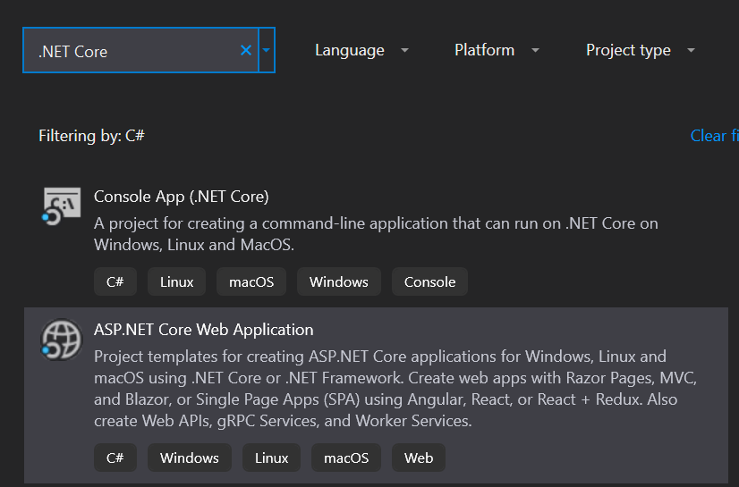

5. 命名你的项目和解决方案。然后选择 _创建_ 按钮

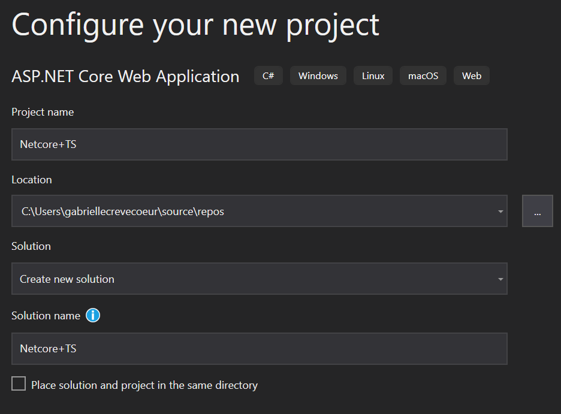

6. 在最后一个窗口中，选择 **空** 模板并点击 _创建_ 按钮

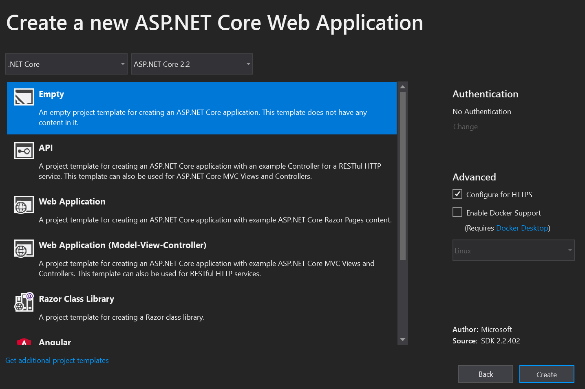

运行应用程序并确保它能正常工作。

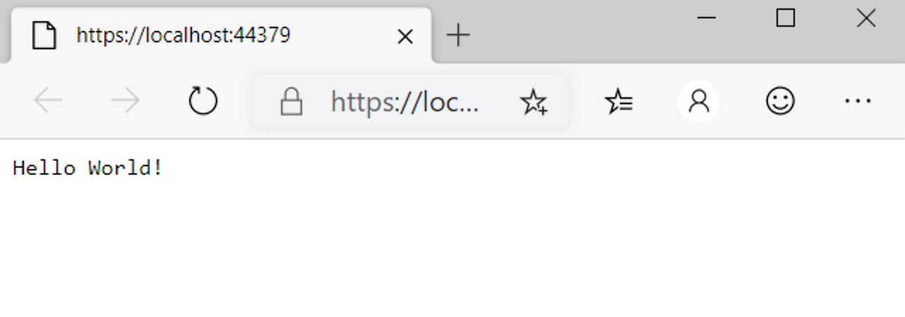

### 设置服务器

打开 **依赖项 > 管理 NuGet 包 > 浏览。** 搜索并安装 `Microsoft.AspNetCore.StaticFiles` 和 `Microsoft.TypeScript.MSBuild`：

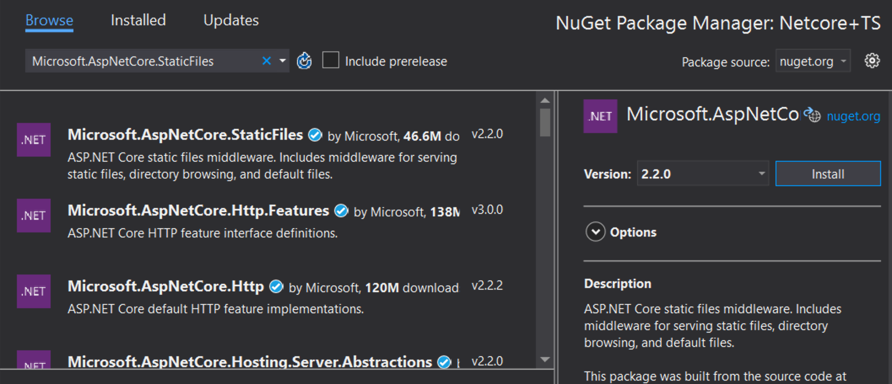

打开你的 `Startup.cs` 文件，将你的 `Configure` 函数编辑为如下所示：

```cs
public void Configure(IApplicationBuilder app, IHostEnvironment env)
{
    if (env.IsDevelopment())
    {
        app.UseDeveloperExceptionPage();
    }

    app.UseDefaultFiles();
    app.UseStaticFiles();
}
```

你可能需要重启 VS，才能让 `UseDefaultFiles` 和 `UseStaticFiles` 下方的红色波浪线消失。

## 添加 TypeScript

接下来，我们将添加一个新文件夹并命名为 `scripts`。

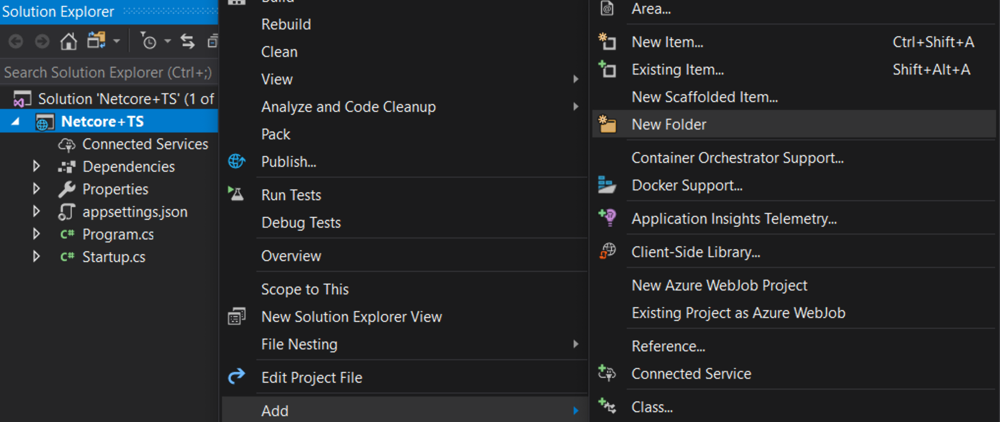

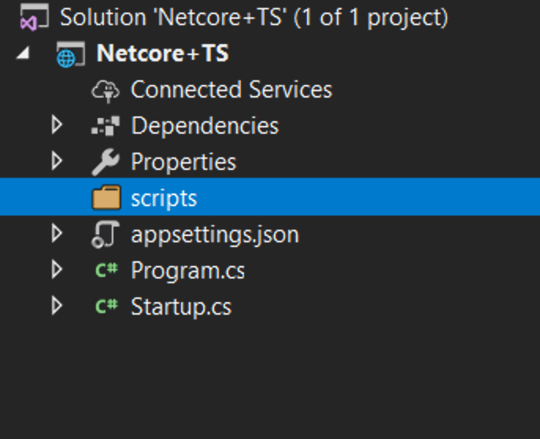

## 添加 TypeScript 代码

右键点击 `scripts`，然后点击 **新建项**。接着选择 **TypeScript 文件** 并将文件命名为 `app.ts`

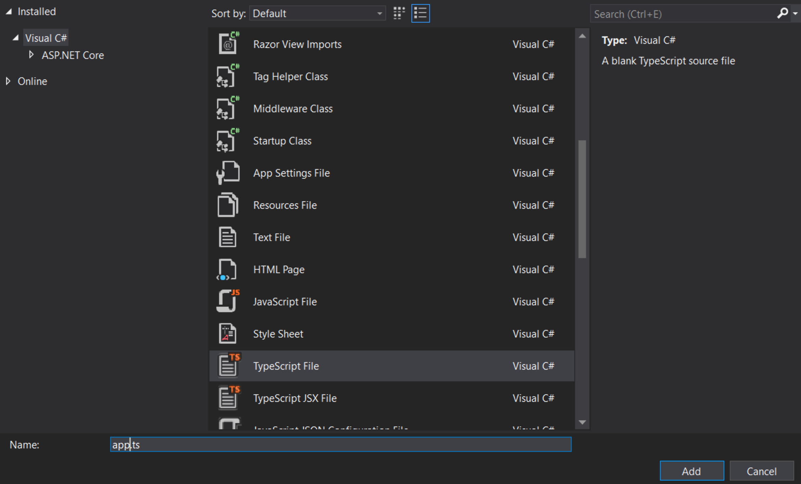

### 添加示例代码

将以下代码添加到 `app.ts` 文件中。

```ts
function sayHello() {
  const compiler = (document.getElementById("compiler") as HTMLInputElement)
    .value;
  const framework = (document.getElementById("framework") as HTMLInputElement)
    .value;
  return `Hello from ${compiler} and ${framework}!`;
}
```

## 设置构建

_配置 TypeScript 编译器_

首先，我们需要告诉 TypeScript 如何构建。右键点击 `scripts`，然后点击 **新建项**。接着选择 **TypeScript 配置文件** 并使用默认名称 `tsconfig.json`

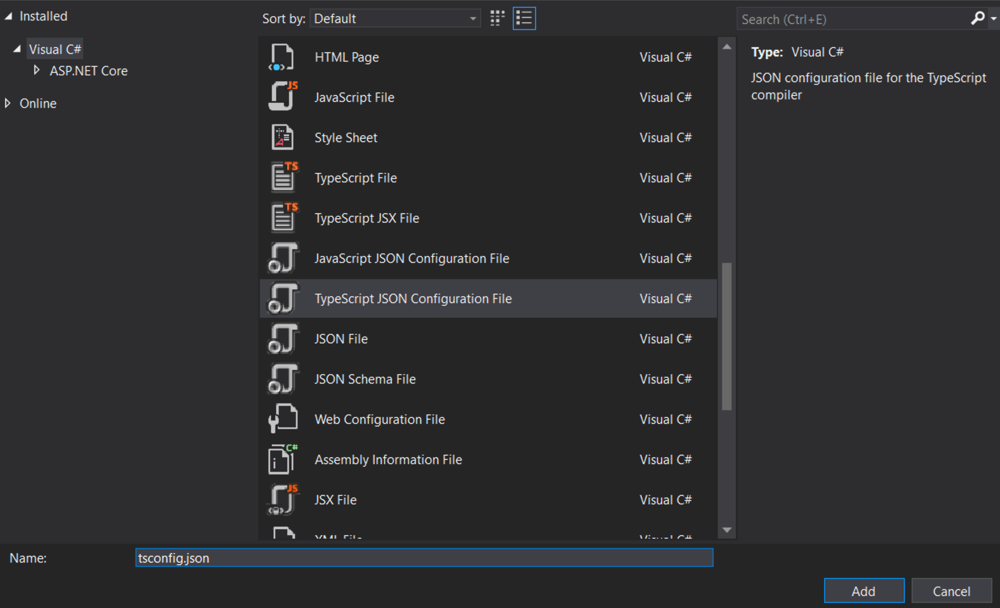

将 `tsconfig.json` 文件的内容替换为：

```json tsconfig
{
  "compilerOptions": {
    "noEmitOnError": true,
    "noImplicitAny": true,
    "sourceMap": true,
    "target": "es6"
  },
  "files": ["./app.ts"],
  "compileOnSave": true
}
```

- [`noEmitOnError`](https://www.typescriptlang.org/tsconfig#noEmitOnError) ：如果报告了任何错误，则不生成输出。
- [`noImplicitAny`](https://www.typescriptlang.org/tsconfig#noImplicitAny) ：对具有隐式 `any` 类型的表达式和声明引发错误。
- [`sourceMap`](https://www.typescriptlang.org/tsconfig#sourceMap) ：生成相应的 `.map` 文件。
- [`target`](https://www.typescriptlang.org/tsconfig#target) ：指定 ECMAScript 目标版本。

注意：`"ESNext"` 目标表示最新支持的版本

[`noImplicitAny`](https://www.typescriptlang.org/tsconfig#noImplicitAny) 在编写新代码时是个好主意 —— 你可以确保不会意外编写任何无类型的代码。`"compileOnSave"` 使在运行的 Web 应用中更新代码变得容易。

#### _设置 NPM_

我们需要设置 NPM，以便下载 JavaScript 包。右键点击项目并选择 **新建项**。接着选择 **NPM 配置文件** 并使用默认名称 `package.json`。

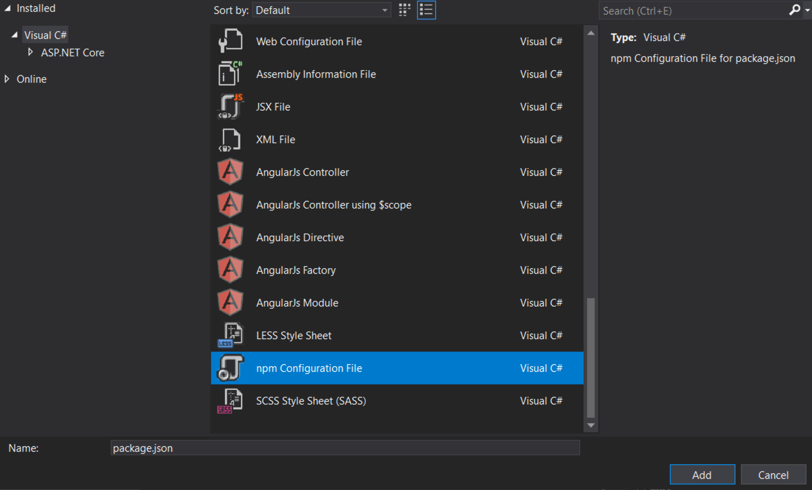

在 `package.json` 文件的 `"devDependencies"` 部分中，添加 _gulp_ 和 _del_

```json tsconfig
"devDependencies": {
    "gulp": "4.0.2",
    "del": "5.1.0"
}
```

保存文件后，Visual Studio 应该开始安装 gulp 和 del。如果没有，右键点击 package.json，然后选择还原包。

之后，你应该能在解决方案资源管理器中看到一个 `npm` 文件夹

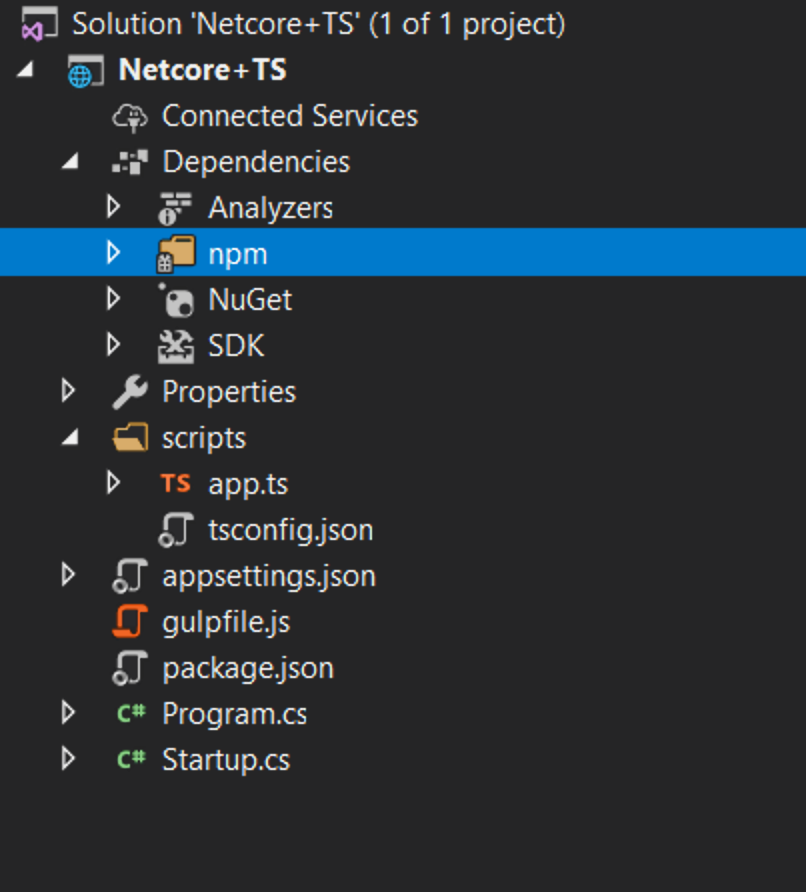

#### _设置 gulp_

右键点击项目，然后点击 **新建项**。接着选择 **JavaScript 文件** 并使用名称 `gulpfile.js`

```js
/// <binding AfterBuild='default' Clean='clean' />
/*
This file is the main entry point for defining Gulp tasks and using Gulp plugins.
Click here to learn more. http://go.microsoft.com/fwlink/?LinkId=518007
*/

var gulp = require("gulp");
var del = require("del");

var paths = {
  scripts: ["scripts/**/*.js", "scripts/**/*.ts", "scripts/**/*.map"],
};

gulp.task("clean", function () {
  return del(["wwwroot/scripts/**/*"]);
});

gulp.task("default", function (done) {
    gulp.src(paths.scripts).pipe(gulp.dest("wwwroot/scripts"));
    done();
});
```

第一行告诉 Visual Studio 在构建完成后运行 'default' 任务。当你要求 Visual Studio 清理构建时，它还会运行 'clean' 任务。

现在右键点击 `gulpfile.js`，然后点击任务运行程序资源管理器。

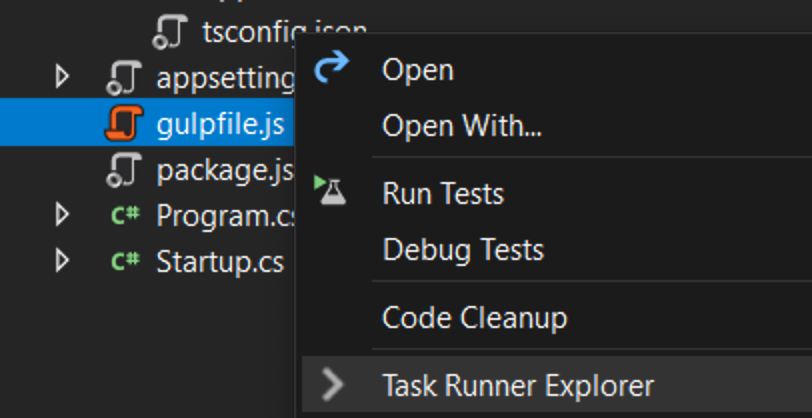

如果 'default' 和 'clean' 任务没有显示，请刷新资源管理器：

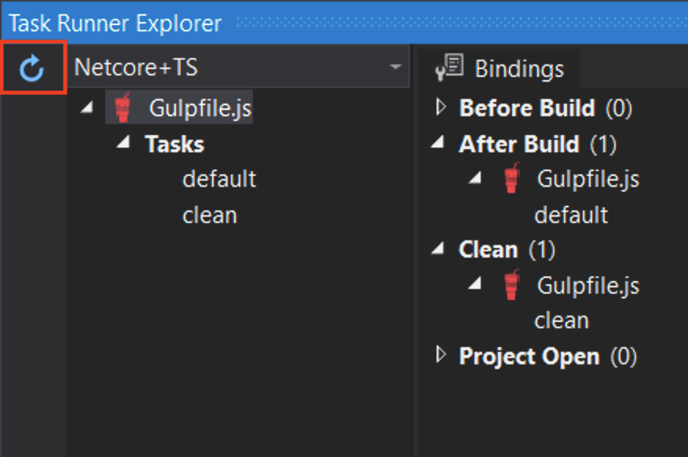

## 编写 HTML 页面

右键点击 `wwwroot` 文件夹（如果你没有看到该文件夹，请尝试构建项目），在其中添加一个名为 `index.html` 的新项。对 `index.html` 使用以下代码

```
<!DOCTYPE html>
<html>
<head>
    <meta charset="utf-8" />
    <script src="scripts/app.js"></script>
    <title></title>
</head>
<body>
    <div id="message"></div>
    <div>
        Compiler: <input id="compiler" value="TypeScript" onkeyup="document.getElementById('message').innerText = sayHello()" /><br />
        Framework: <input id="framework" value="ASP.NET" onkeyup="document.getElementById('message').innerText = sayHello()" />
    </div>
</body>
</html>
```

## 测试

1. 运行项目
2. 当你在输入框中输入时，你应该会看到消息出现/变化！


## 调试

1. 在 Edge 浏览器中，按 F12 并点击调试器选项卡。
2. 查看第一个 localhost 文件夹，然后找到 scripts/app.ts
3. 在 return 语句所在行设置断点。
4. 在输入框中输入并确认断点在 TypeScript 代码中被命中，并且检查功能正常工作。

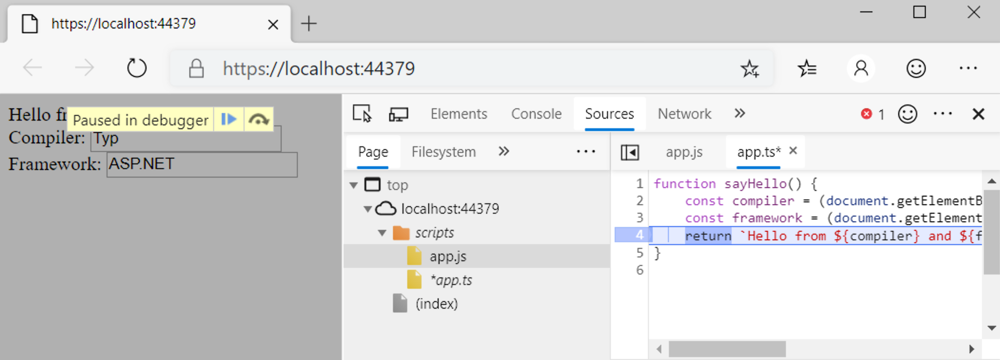

恭喜你，你已经构建了自己的带有 TypeScript 前端的 .NET Core 项目。
