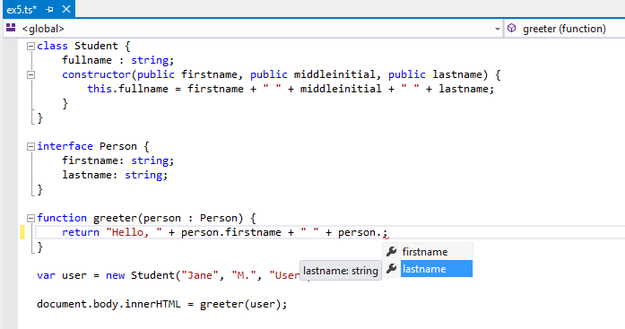

让我们通过构建一个简单的 Web 应用程序来开始使用 TypeScript。

## 安装 TypeScript

有两种主要方式将 TypeScript 添加到你的项目中：

- 通过 npm（Node.js 包管理器）
- 安装 TypeScript 的 Visual Studio 插件

Visual Studio 2017 和 Visual Studio 2015 Update 3 默认包含 TypeScript 语言支持，但不包含 TypeScript 编译器 `tsc`。
如果你没有随 Visual Studio 一起安装 TypeScript，你仍然可以[下载它](/download)。

对于 npm 用户：

```shell
> npm install -g typescript
```

## 构建你的第一个 TypeScript 文件

在你的编辑器中，在 `greeter.ts` 中输入以下 JavaScript 代码：

```ts twoslash
// @noImplicitAny: false
function greeter(person) {
  return "Hello, " + person;
}

let user = "Jane User";

document.body.textContent = greeter(user);
```

## 编译你的代码

我们使用了 `.ts` 扩展名，但这代码就是 JavaScript。
你可以直接从现有的 JavaScript 应用中复制/粘贴这段代码。

在命令行中，运行 TypeScript 编译器：

```shell
tsc greeter.ts
```

结果将是一个 `greeter.js` 文件，其中包含你输入的相同 JavaScript。
我们已经在 JavaScript 应用中成功运行 TypeScript 了！

现在我们可以开始利用 TypeScript 提供的一些新工具了。
给 'person' 函数参数添加 `: string` 类型注解，如下所示：

```ts twoslash
function greeter(person: string) {
  return "Hello, " + person;
}

let user = "Jane User";

document.body.textContent = greeter(user);
```

## 类型注解

TypeScript 中的类型注解是记录函数或变量预期约定的轻量级方式。
在这个例子中，我们期望 greeter 函数被调用时传入一个字符串参数。
我们可以尝试更改调用 greeter 的代码，改为传递一个数组：

```ts twoslash
// @errors: 2345
function greeter(person: string) {
  return "Hello, " + person;
}

let user = [0, 1, 2];

document.body.textContent = greeter(user);
```

重新编译，你现在会看到一个错误：

```shell
error TS2345: Argument of type 'number[]' is not assignable to parameter of type 'string'.
```

同样，尝试移除 greeter 调用的所有参数。
TypeScript 会告诉你，你使用了意外数量的参数调用了这个函数。
在这两种情况下，TypeScript 都可以基于你的代码结构以及你提供的类型注解提供静态分析。

注意，尽管有错误，`greeter.js` 文件仍然被创建了。
即使你的代码中有错误，你也可以使用 TypeScript。但在这种情况下，TypeScript 正在警告你的代码可能无法按预期运行。

## 接口

让我们进一步开发我们的示例。这里我们使用一个接口来描述具有 firstName 和 lastName 字段的对象。
在 TypeScript 中，如果两个类型的内部结构兼容，它们就是兼容的。
这允许我们通过拥有接口所需的形状来实现接口，而无需显式的 `implements` 子句。

```ts twoslash
interface Person {
  firstName: string;
  lastName: string;
}

function greeter(person: Person) {
  return "Hello, " + person.firstName + " " + person.lastName;
}

let user = { firstName: "Jane", lastName: "User" };

document.body.textContent = greeter(user);
```

## 类

最后，让我们用类最后一次扩展这个示例。
TypeScript 支持 JavaScript 的新特性，例如对基于类的面向对象编程的支持。

这里我们要创建一个带有构造函数和一些公共字段的 `Student` 类。
注意，类和接口可以很好地协同工作，让程序员决定正确的抽象级别。

另外值得注意的是，在构造函数的参数上使用 `public` 是一种简写，允许我们自动创建具有该名称的属性。

```ts twoslash
class Student {
  fullName: string;
  constructor(
    public firstName: string,
    public middleInitial: string,
    public lastName: string
  ) {
    this.fullName = firstName + " " + middleInitial + " " + lastName;
  }
}

interface Person {
  firstName: string;
  lastName: string;
}

function greeter(person: Person) {
  return "Hello, " + person.firstName + " " + person.lastName;
}

let user = new Student("Jane", "M.", "User");

document.body.textContent = greeter(user);
```

重新运行 `tsc greeter.ts`，你会看到生成的 JavaScript 与之前的代码相同。
TypeScript 中的类只是 JavaScript 中经常使用的基于原型的面向对象的简写。

## 运行你的 TypeScript Web 应用

现在在 `greeter.html` 中输入以下内容：

```html
<!DOCTYPE html>
<html>
  <head>
    <title>TypeScript Greeter</title>
  </head>
  <body>
    <script src="greeter.js"></script>
  </body>
</html>
```

在浏览器中打开 `greeter.html` 来运行你的第一个简单的 TypeScript Web 应用程序！

可选：在 Visual Studio 中打开 `greeter.ts`，或将代码复制到 TypeScript Playground 中。
你可以将鼠标悬停在标识符上查看它们的类型。
注意在某些情况下，这些类型会自动为你推断。
重新输入最后一行，查看基于 DOM 元素类型的完成列表和参数帮助。
将光标放在对 greeter 函数的引用上，按 F12 跳转到其定义。
注意，你还可以右键单击符号并使用重构来重命名它。

提供的类型信息与工具协同工作，以应用程序规模处理 JavaScript。
有关 TypeScript 可能实现的功能的更多示例，请参阅网站的 Samples 部分。


